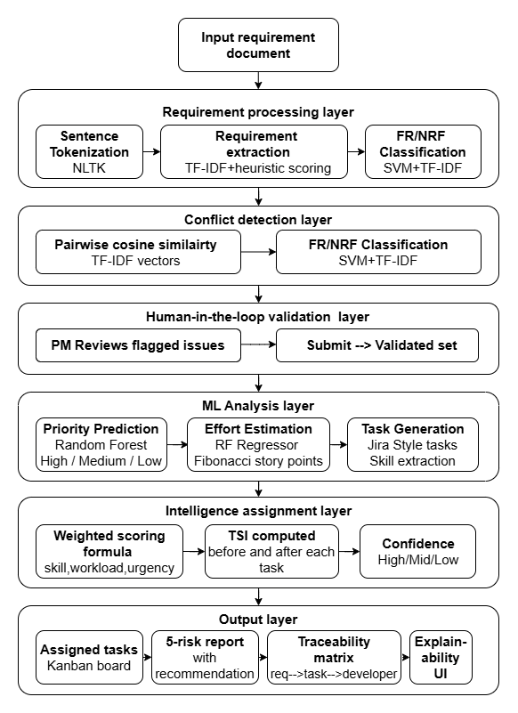
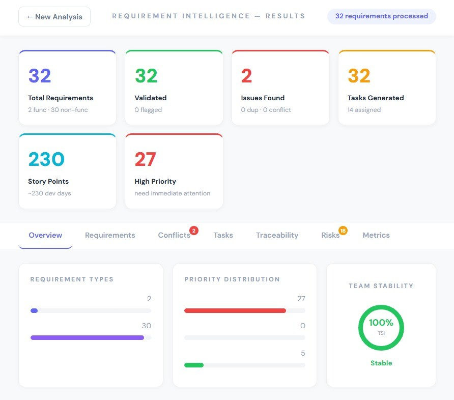
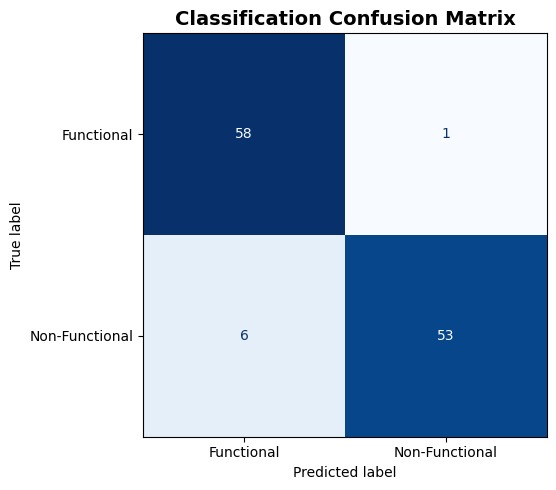

# AI Requirement Intelligence and Project Management System

## Overview
This project automates software requirement analysis using NLP and Machine Learning.

The system:
- Extracts requirements from SRS/PRD documents
- Classifies requirements as functional or non-functional
- Detects conflicts and ambiguities
- Predicts requirement priority
- Estimates effort using Fibonacci story points
- Generates tasks automatically
- Assigns tasks intelligently to employees
- Maintains requirement traceability
- Performs workload and risk analysis

---

## Features

### Requirement Analysis
- Requirement extraction using NLP
- Functional vs Non-functional classification
- Conflict and duplicate detection
- Ambiguity identification

### Machine Learning
- SVM-based requirement classification
- Random Forest priority prediction
- Random Forest effort estimation

### Project Management
- Intelligent task assignment
- Workload balancing
- Team Stability Index (TSI)
- Risk analysis dashboard
- Traceability matrix

---

## Technologies Used

### Backend
- Python
- FastAPI
- scikit-learn
- NLTK
- spaCy

### Frontend
- React
- HTML/CSS
- JavaScript

---

## System Architecture



---

## Dashboard



---

## Evaluation Results

### Classification Accuracy


### Confusion Matrix


---

## Folder Structure

```text
backend/
frontend/
intelligence/
models/
evaluation/
assets/
```

---

## Authors
BHADRA R B
ESHAL P
FATHIMA A K